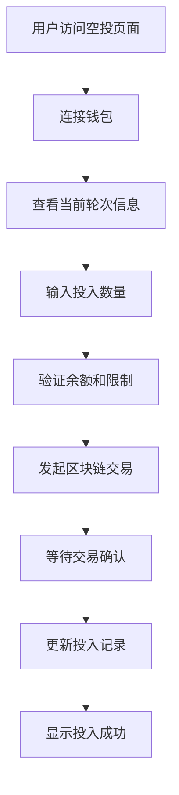
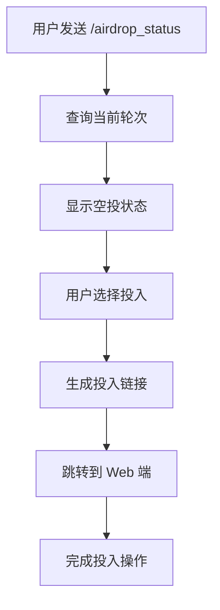

# 6. 小红花空投池机制

## 6.1 概述

小红花空投池是 SocioMint 生态系统中的创新机制，允许用户使用小红花参与每周的 SM 代币空投。该机制结合了社交任务系统和代币经济学，为用户提供了一种全新的获得 SM 代币的方式。

### 6.1.1 设计理念

- **社交价值转化**: 将社交活动产生的小红花转化为具有经济价值的 SM 代币
- **公平分配**: 基于投入比例的公平奖励分配机制
- **神秘感**: 盲盒式的奖励分配，增加参与的趣味性
- **社区驱动**: 鼓励用户积极参与社交任务，建设活跃社区

### 6.1.2 核心特性

- **每周结算**: 固定的 7 天周期，确保规律性和可预期性
- **比例分配**: 根据用户投入的小红花比例分配 SM 代币奖励
- **多平台验证**: 支持 X、Telegram、Discord 等平台绑定验证
- **透明可查**: 所有投入和奖励记录均可在区块链上查询

## 6.2 机制详解

### 6.2.1 空投轮次

每个空投轮次包含以下阶段：

```
轮次生命周期:
开始 → 投入期 (7天) → 结算期 → 领取期 → 下一轮开始
```

#### 投入期 (7天)
- 用户可以投入小红花到空投池
- 每个用户每轮只能投入一次
- 投入金额有最小值和最大值限制
- 实时显示总投入和参与人数

#### 结算期 (管理员操作)
- 管理员设置本轮 SM 代币奖励总量
- 系统自动计算每个用户的奖励比例
- 更新用户可领取奖励金额

#### 领取期 (无时间限制)
- 用户可以随时领取已分配的奖励
- 支持批量领取多轮奖励
- 领取记录永久保存

### 6.2.2 奖励计算公式

```
用户奖励 = (用户投入小红花 / 总投入小红花) × 本轮SM奖励总量
```

#### 示例计算

假设本轮参数：
- 总 SM 奖励：500万 SM
- 总投入小红花：100万朵
- 用户 A 投入：1000朵小红花

用户 A 的奖励 = (1000 / 1,000,000) × 5,000,000 = 5000 SM

### 6.2.3 投入限制

| 参数 | 默认值 | 说明 |
|------|--------|------|
| 最小投入 | 10 小红花 | 防止垃圾投入 |
| 最大投入 | 10,000 小红花 | 防止过度集中 |
| 每轮投入次数 | 1 次 | 确保公平性 |
| 轮次持续时间 | 7 天 | 固定周期 |

## 6.3 技术实现

### 6.3.1 智能合约架构

```solidity
contract AirdropPool {
    struct Round {
        uint256 id;
        uint256 startTime;
        uint256 endTime;
        uint256 totalDeposits;
        uint256 totalRewards;
        uint256 participantCount;
        bool distributed;
    }

    struct UserDeposit {
        uint256 amount;
        uint256 roundId;
        uint256 timestamp;
        bool claimed;
    }

    // 核心功能
    function depositFlowers(uint256 amount) external;
    function claimReward(uint256 roundId) external;
    function distributeRewards(uint256 roundId) external;
}
```

### 6.3.2 数据库设计

#### 核心表结构

```sql
-- 空投轮次表
CREATE TABLE airdrop_rounds (
    round_id BIGINT PRIMARY KEY,
    start_time TIMESTAMP,
    end_time TIMESTAMP,
    total_deposits NUMERIC(36,18),
    total_rewards NUMERIC(36,18),
    participant_count INTEGER,
    is_distributed BOOLEAN
);

-- 用户投入记录表
CREATE TABLE airdrop_deposits (
    user_id UUID,
    round_id BIGINT,
    deposited_flowers NUMERIC(36,18),
    actual_reward NUMERIC(36,18),
    is_claimed BOOLEAN,
    UNIQUE(user_id, round_id)
);
```

### 6.3.3 安全机制

#### 智能合约安全
- **重入攻击防护**: 使用 ReentrancyGuard
- **权限控制**: 基于 Ownable 的管理员权限
- **暂停机制**: 紧急情况下可暂停合约
- **升级能力**: UUPS 代理模式支持合约升级

#### 数据安全
- **行级安全**: Supabase RLS 策略保护用户数据
- **输入验证**: 前端和后端双重验证
- **交易确认**: 区块链交易确认机制

## 6.4 用户交互流程

### 6.4.1 Web 端流程



### 4.2 Telegram Bot 流程



### 6.4.3 移动端适配

- **响应式设计**: 适配各种屏幕尺寸
- **触摸优化**: 大按钮和手势支持
- **离线缓存**: 关键数据本地缓存
- **推送通知**: 轮次开始/结束提醒

## 6.5 经济模型

### 6.5.1 代币流动

```
小红花获得途径:
社交任务 → 小红花奖励 → 空投池投入 → SM代币奖励
```

### 6.5.2 价值锚定

- **小红花价值**: 通过空投池机制与 SM 代币建立价值联系
- **SM 代币价值**: 通过交易所价格和实用性支撑
- **动态平衡**: 市场供需自动调节投入积极性

### 6.5.3 通胀控制

| 机制 | 作用 | 效果 |
|------|------|------|
| 固定周期 | 控制发放频率 | 避免过度通胀 |
| 投入限制 | 限制单次投入 | 防止垄断 |
| 奖励上限 | 每周固定奖励 | 可预期的供应量 |

## 6.6 运营策略

### 6.6.1 初期推广

- **高奖励比例**: 初期提供更高的 SM 奖励吸引用户
- **社交传播**: 利用现有社交任务系统推广
- **KOL 合作**: 邀请意见领袖参与和推广
- **教育内容**: 制作教程和说明材料

### 6.6.2 长期维护

- **奖励调整**: 根据参与度动态调整奖励
- **功能优化**: 持续改进用户体验
- **社区治理**: 逐步引入社区投票机制
- **生态扩展**: 与其他 DeFi 协议集成

### 6.6.3 风险管理

- **流动性风险**: 确保足够的 SM 代币储备
- **技术风险**: 多重测试和审计
- **合规风险**: 遵守相关法律法规
- **市场风险**: 建立风险预警机制

## 6.7 数据分析

### 6.7.1 关键指标

- **参与率**: 每轮参与用户数 / 总用户数
- **投入总量**: 每轮小红花投入总量
- **奖励分配**: SM 代币分配效率
- **用户留存**: 连续参与轮次的用户比例

### 6.7.2 监控面板

```typescript
interface AirdropMetrics {
  currentRound: {
    id: number;
    participants: number;
    totalDeposits: number;
    timeRemaining: number;
  };
  historical: {
    totalRounds: number;
    totalParticipants: number;
    totalRewardsDistributed: number;
    averageParticipation: number;
  };
  trends: {
    participationGrowth: number;
    depositGrowth: number;
    userRetention: number;
  };
}
```

## 6.8 技术架构详解

### 6.8.1 系统架构图

```
┌─────────────────────────────────────────────────────────────┐
│                    SocioMint 技术架构                        │
├─────────────────────────────────────────────────────────────┤
│  前端层 (Frontend Layer)                                    │
│  ┌─────────────┐ ┌─────────────┐ ┌─────────────┐           │
│  │ React/Next  │ │ Web3 钱包   │ │ 移动端 PWA  │           │
│  │ TypeScript  │ │ 集成        │ │ 响应式设计  │           │
│  └─────────────┘ └─────────────┘ └─────────────┘           │
├─────────────────────────────────────────────────────────────┤
│  API 层 (API Layer)                                        │
│  ┌─────────────┐ ┌─────────────┐ ┌─────────────┐           │
│  │ Next.js API │ │ GraphQL     │ │ WebSocket   │           │
│  │ Routes      │ │ 查询        │ │ 实时通信    │           │
│  └─────────────┘ └─────────────┘ └─────────────┘           │
├─────────────────────────────────────────────────────────────┤
│  业务逻辑层 (Business Logic Layer)                          │
│  ┌─────────────┐ ┌─────────────┐ ┌─────────────┐           │
│  │ 社交平台    │ │ 空投池      │ │ 代币交换    │           │
│  │ API 集成    │ │ 管理        │ │ 逻辑        │           │
│  └─────────────┘ └─────────────┘ └─────────────┘           │
├─────────────────────────────────────────────────────────────┤
│  数据层 (Data Layer)                                       │
│  ┌─────────────┐ ┌─────────────┐ ┌─────────────┐           │
│  │ Supabase    │ │ Redis       │ │ IPFS        │           │
│  │ PostgreSQL  │ │ 缓存        │ │ 文件存储    │           │
│  └─────────────┘ └─────────────┘ └─────────────┘           │
├─────────────────────────────────────────────────────────────┤
│  区块链层 (Blockchain Layer)                               │
│  ┌─────────────┐ ┌─────────────┐ ┌─────────────┐           │
│  │ BSC 主网    │ │ 智能合约    │ │ 事件监听    │           │
│  │ 网络        │ │ 部署        │ │ 系统        │           │
│  └─────────────┘ └─────────────┘ └─────────────┘           │
├─────────────────────────────────────────────────────────────┤
│  外部集成层 (External Integration Layer)                   │
│  ┌─────────────┐ ┌─────────────┐ ┌─────────────┐           │
│  │ Twitter API │ │ Discord API │ │ Telegram    │           │
│  │ OAuth 2.0   │ │ Bot 集成    │ │ Bot API     │           │
│  └─────────────┘ └─────────────┘ └─────────────┘           │
├─────────────────────────────────────────────────────────────┤
│  监控层 (Monitoring Layer)                                 │
│  ┌─────────────┐ ┌─────────────┐ ┌─────────────┐           │
│  │ Sentry      │ │ Google      │ │ 区块链      │           │
│  │ 错误追踪    │ │ Analytics   │ │ 监控        │           │
│  └─────────────┘ └─────────────┘ └─────────────┘           │
└─────────────────────────────────────────────────────────────┘
```

### 6.8.2 数据流架构

```
用户操作流程:
┌─────────┐    ┌─────────┐    ┌─────────┐    ┌─────────┐
│ 用户界面 │───▶│ API 层  │───▶│ 业务逻辑 │───▶│ 数据库  │
└─────────┘    └─────────┘    └─────────┘    └─────────┘
     │              │              │              │
     ▼              ▼              ▼              ▼
┌─────────┐    ┌─────────┐    ┌─────────┐    ┌─────────┐
│ 钱包集成 │    │ 身份验证 │    │ 权限控制 │    │ 事件记录 │
└─────────┘    └─────────┘    └─────────┘    └─────────┘
     │              │              │              │
     ▼              ▼              ▼              ▼
┌─────────┐    ┌─────────┐    ┌─────────┐    ┌─────────┐
│ 区块链  │    │ 社交平台 │    │ 监控系统 │    │ 通知服务 │
│ 交互    │    │ API     │    │ 告警    │    │ 推送    │
└─────────┘    └─────────┘    └─────────┘    └─────────┘
```

### 6.8.3 Supabase 数据表关系图

```
用户相关表:
user_profiles ──┬── user_balances
                ├── user_actions
                ├── social_tokens
                └── guild_members

空投池相关表:
airdrop_rounds ──┬── airdrop_deposits
                 ├── airdrop_events
                 └── user_airdrop_stats

社交相关表:
guilds ──── guild_members
social_task_templates ──── user_actions
auth_states (临时表)

奖励相关表:
red_flower_rewards ──── user_actions
```

### 6.8.4 智能合约架构

```solidity
合约继承关系:
AirdropPool
├── Initializable (OpenZeppelin)
├── UUPSUpgradeable (OpenZeppelin)
├── OwnableUpgradeable (OpenZeppelin)
├── ReentrancyGuardUpgradeable (OpenZeppelin)
└── PausableUpgradeable (OpenZeppelin)

主要合约:
┌─────────────────┐
│   AirdropPool   │ ──── 空投池主合约
├─────────────────┤
│ SMToken         │ ──── SM 代币合约
├─────────────────┤
│ RedFlowerToken  │ ──── 小红花代币合约
├─────────────────┤
│ SMTokenExchange │ ──── 代币交换合约
└─────────────────┘
```

### 6.8.5 API 端点架构

```
认证相关:
POST /api/auth/wallet/verify     - 钱包签名验证
POST /api/auth/twitter/callback  - Twitter OAuth 回调
POST /api/auth/discord/callback  - Discord OAuth 回调

社交平台:
POST /api/verify/twitter         - Twitter 行为验证
POST /api/verify/discord         - Discord 行为验证
GET  /api/social/stats          - 社交统计数据

空投池:
GET  /api/airdrop/current       - 当前轮次信息
POST /api/airdrop/deposit       - 投入小红花
POST /api/airdrop/claim         - 领取奖励
GET  /api/airdrop/leaderboard   - 排行榜

监控:
GET  /api/health                - 健康检查
GET  /api/metrics               - 系统指标
POST /api/webhook/discord       - Discord 通知
```

## 6.9 未来发展

### 6.9.1 功能扩展

- **多代币支持**: 支持其他代币作为奖励
- **NFT 奖励**: 特殊轮次提供 NFT 奖励
- **质押增强**: 质押 SM 代币获得投入加成
- **社交增强**: 邀请好友获得额外奖励

### 6.9.2 技术升级

- **Layer 2 集成**: 降低交易成本
- **跨链支持**: 支持多个区块链网络
- **AI 优化**: 智能调整奖励参数
- **隐私保护**: 零知识证明技术应用

### 6.9.3 生态整合

- **DeFi 协议**: 与借贷、交易协议集成
- **GameFi 元素**: 增加游戏化元素
- **DAO 治理**: 社区治理机制
- **元宇宙**: 虚拟世界中的空投活动

## 6.9 总结

小红花空投池机制是 SocioMint 生态系统的重要组成部分，它：

1. **连接社交与经济**: 将社交活动的价值转化为经济收益
2. **促进社区活跃**: 激励用户持续参与社交任务
3. **公平分配价值**: 基于贡献的公平奖励机制
4. **技术创新**: 结合区块链和传统互联网技术
5. **可持续发展**: 建立长期可持续的代币经济模型

通过持续的优化和发展，空投池机制将成为 Web3 社交平台的标杆功能，为整个行业提供有价值的参考和借鉴。
