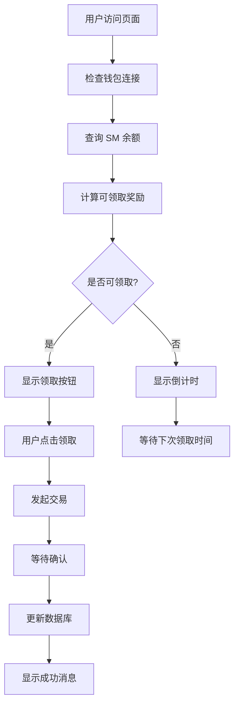

# 7. 每日持币奖励机制

## 7.1 概述

每日持币奖励是 SocioMint 生态系统中的重要激励机制，旨在奖励长期持有 SM 代币的用户，增强代币的价值锚定和用户粘性。通过持有 SM 代币，用户可以每日获得小红花奖励，形成稳定的被动收入来源。

### 7.1.1 设计理念

- **长期价值**: 鼓励用户长期持有 SM 代币，减少市场波动
- **被动收入**: 为持币用户提供稳定的每日收益
- **生态循环**: 小红花可用于参与空投池，形成完整的价值循环
- **简单易用**: 一键领取，无需复杂操作

### 7.1.2 核心优势

- **零风险收益**: 持币即可获得奖励，无需质押锁定
- **复利效应**: 获得的小红花可参与空投池获得更多 SM 代币
- **社交激励**: 结合社交任务，增强用户参与度
- **透明公平**: 链上执行，奖励规则完全透明

## 7.2 奖励机制详解

### 7.2.1 奖励公式

每日持币奖励基于用户的 SM 代币余额计算：

```
每日小红花奖励 = floor(SM余额 / 500) × 10
最大每日奖励 = min(计算奖励, 200)
```

**公式说明**:
- 每持有 500 SM 代币可获得 10 朵小红花
- 使用向下取整，确保奖励的整数性
- 每日最大奖励限制为 200 朵小红花
- 对应最大有效持币量为 10,000 SM

### 7.2.2 奖励阶梯

| SM 持币量 | 每日小红花奖励 | 年化收益率* |
|-----------|----------------|-------------|
| 500 | 10 | 7.3% |
| 1,000 | 20 | 7.3% |
| 2,500 | 50 | 7.3% |
| 5,000 | 100 | 7.3% |
| 10,000 | 200 | 7.3% |
| 10,000+ | 200 | 递减 |

*年化收益率基于小红花与 SM 代币的当前兑换比例计算

### 7.2.3 持币奖励曲线图

```
每日奖励 (小红花)
    ↑
200 |                    ●●●●●●●●●●●
    |                 ●●●
150 |              ●●●
    |           ●●●
100 |        ●●●
    |     ●●●
 50 |  ●●●
    |●●
  0 +--+--+--+--+--+--+--+--+--+--→
    0  1k 2k 3k 4k 5k 6k 7k 8k 9k 10k+ SM持币量

图例：
● 实际奖励点
— 线性增长区间 (0-10,000 SM)
— 封顶区间 (10,000+ SM)
```

## 7.3 技术实现

### 7.3.1 智能合约架构

```solidity
contract SMTokenExchangeV2 {
    // 奖励配置
    uint256 public flowersPer500Sm = 10;
    uint256 public maxDailyFlowersPerUser = 200;
    uint256 public constant DAILY_CLAIM_INTERVAL = 24 hours;
    
    // 用户领取记录
    mapping(address => uint256) public lastClaimTime;
    mapping(address => uint256) public totalDailyFlowersClaimed;
    
    // 核心函数
    function claimDailyFlowers() external;
    function getDailyFlowerAmount(address user) public view returns (uint256);
    function getUserDailyRewardInfo(address user) external view returns (...);
}
```

### 7.3.2 防重放攻击机制

#### 链上验证
- **时间间隔检查**: 确保用户距离上次领取已超过 24 小时
- **余额验证**: 实时检查用户 SM 代币余额
- **重入保护**: 使用 ReentrancyGuard 防止重入攻击

#### 链下验证 (Supabase)
```sql
-- 检查用户是否可以领取每日奖励
CREATE FUNCTION can_claim_daily_reward(
    p_user_wallet TEXT, 
    p_claim_date DATE DEFAULT CURRENT_DATE
) RETURNS BOOLEAN AS $$
BEGIN
    RETURN NOT EXISTS(
        SELECT 1 FROM daily_reward_claims 
        WHERE user_wallet = p_user_wallet 
        AND claim_date = p_claim_date
    );
END;
$$ LANGUAGE plpgsql;
```

### 7.3.3 数据存储架构

#### 主要数据表

1. **daily_reward_claims**: 每日领取记录
   - 用户钱包地址
   - 领取日期
   - SM 余额快照
   - 奖励数量
   - 交易哈希

2. **user_daily_reward_stats**: 用户统计
   - 总领取次数
   - 累计奖励
   - 连续领取天数
   - 平均每日奖励

3. **daily_reward_leaderboard**: 每日排行榜
   - 排名
   - 用户信息
   - 当日奖励
   - SM 余额

## 7.4 用户体验流程

### 7.4.1 领取流程



### 7.4.2 前端界面设计

#### 每日奖励卡片组件
- **持币信息**: 显示当前 SM 余额
- **奖励预览**: 显示可领取的小红花数量
- **进度条**: 可视化奖励进度 (0-200 小红花)
- **状态指示**: 可领取/已领取/倒计时
- **统计信息**: 累计领取次数和总奖励

#### 交互元素
- **一键领取**: 简化的领取按钮
- **实时刷新**: 自动更新数据
- **倒计时显示**: 下次可领取时间
- **奖励历史**: 查看历史领取记录

### 7.4.3 Telegram Bot 集成

#### 支持命令
- `/daily`: 查看每日奖励状态
- `/claim_daily`: 领取每日奖励
- `/daily_stats`: 查看个人统计
- `/daily_leaderboard`: 查看排行榜

#### 自动推送
- **每日提醒**: 上午 10 点提醒用户领取
- **排行榜**: 晚上 8 点推送当日排行榜
- **连续奖励**: 连续领取里程碑提醒

## 7.5 经济模型分析

### 7.5.1 代币流通影响

#### 正面影响
- **减少抛压**: 鼓励长期持有，减少短期抛售
- **增加需求**: 为获得奖励而购买 SM 代币
- **价值锚定**: 提供持币的内在价值支撑
- **流动性管理**: 通过奖励调节市场流动性

#### 通胀控制
- **固定上限**: 每日最大奖励 200 小红花/用户
- **参与率限制**: 实际参与用户数量有限
- **价值转换**: 小红花需通过空投池转换为 SM

### 7.5.2 奖励可持续性

#### 资金来源
1. **交易手续费**: 平台交易产生的手续费
2. **广告收入**: 社交广告平台的收入分成
3. **生态基金**: 专门的奖励基金池
4. **合作伙伴**: 外部项目的奖励赞助

#### 动态调整机制
```solidity
function setDailyRewardConfig(
    uint256 _flowersPer500Sm,
    uint256 _maxDailyFlowersPerUser
) external onlyOwner {
    flowersPer500Sm = _flowersPer500Sm;
    maxDailyFlowersPerUser = _maxDailyFlowersPerUser;
    emit DailyRewardConfigUpdated(_flowersPer500Sm, _maxDailyFlowersPerUser);
}
```

### 7.5.3 收益率分析

#### 基准收益率
- **当前设置**: 年化约 7.3%
- **市场对比**: 优于传统储蓄，低于高风险投资
- **稳定性**: 收益稳定，风险较低

#### 收益率影响因素
1. **小红花兑换率**: 影响实际收益价值
2. **参与用户数**: 影响奖励池分配
3. **SM 代币价格**: 影响持币成本
4. **配置调整**: 管理员可调整奖励参数

## 7.6 风险管理

### 7.6.1 技术风险

#### 智能合约风险
- **代码审计**: 第三方安全审计
- **升级机制**: UUPS 代理模式支持升级
- **暂停功能**: 紧急情况下可暂停合约
- **多重签名**: 关键操作需要多重签名

#### 系统风险
- **预言机风险**: 依赖外部价格数据
- **网络风险**: 区块链网络拥堵或故障
- **前端风险**: 用户界面安全性
- **数据库风险**: 链下数据存储安全

### 7.6.2 经济风险

#### 通胀风险
- **奖励上限**: 限制每日最大奖励
- **参与门槛**: 最低持币要求
- **动态调整**: 根据市场情况调整参数
- **监控机制**: 实时监控奖励发放情况

#### 市场风险
- **价格波动**: SM 代币价格波动影响收益
- **流动性风险**: 大量用户同时抛售
- **竞争风险**: 其他项目提供更高收益
- **监管风险**: 政策变化影响运营

### 7.6.3 应对策略

#### 技术应对
- **多层安全**: 链上+链下双重验证
- **实时监控**: 异常交易自动告警
- **快速响应**: 24小时技术支持
- **备份机制**: 多重数据备份

#### 经济应对
- **储备基金**: 维持足够的奖励储备
- **保险机制**: 考虑引入保险保障
- **合作伙伴**: 多元化资金来源
- **透明度**: 定期公布财务状况

## 7.7 数据分析与监控

### 7.7.1 关键指标

#### 参与度指标
- **日活跃用户**: 每日领取奖励的用户数
- **参与率**: 符合条件用户的参与比例
- **连续性**: 用户连续领取天数分布
- **留存率**: 用户长期参与情况

#### 经济指标
- **奖励发放量**: 每日/月度奖励发放总量
- **平均奖励**: 用户平均每日奖励
- **成本效益**: 奖励成本与用户价值比
- **ROI**: 奖励投入的回报率

### 7.7.2 数据可视化

#### 实时仪表板
```
┌─────────────────────────────────────────────────────────┐
│                SocioMint 每日奖励监控                    │
├─────────────────────────────────────────────────────────┤
│ 今日统计                                                │
│ 👥 参与用户: 1,234 (+5.2%)                             │
│ 🌸 发放奖励: 156,780 小红花 (+3.1%)                    │
│ 💰 平均奖励: 127 小红花/用户                           │
│ 📊 参与率: 78.5% (+2.1%)                              │
├─────────────────────────────────────────────────────────┤
│ 本月累计                                                │
│ 👥 总参与: 15,678 人次                                 │
│ 🌸 总发放: 2,345,670 小红花                           │
│ 💎 平均持币: 3,456 SM/用户                            │
│ 🔥 最长连续: 28 天                                     │
└─────────────────────────────────────────────────────────┘
```

#### 趋势分析图表
- **参与度趋势**: 每日参与用户数变化
- **奖励分布**: 不同持币量用户的奖励分布
- **连续性分析**: 用户连续领取天数统计
- **收益率曲线**: 不同时期的实际收益率

### 7.7.3 预警机制

#### 异常检测
- **大额领取**: 单用户异常大额奖励
- **频率异常**: 短时间内大量领取
- **余额异常**: 用户余额突然大幅变化
- **系统异常**: 合约调用失败率过高

#### 自动告警
```typescript
// 告警规则示例
const alertRules = {
  highVolumeAlert: {
    condition: 'daily_claims > 10000',
    action: 'notify_admin',
    severity: 'warning'
  },
  lowParticipationAlert: {
    condition: 'participation_rate < 50%',
    action: 'investigate',
    severity: 'info'
  },
  contractErrorAlert: {
    condition: 'error_rate > 5%',
    action: 'emergency_response',
    severity: 'critical'
  }
};
```

## 7.8 未来发展规划

### 7.8.1 功能扩展

#### 短期规划 (1-3 月)
- **等级系统**: 基于连续领取天数的用户等级
- **加成机制**: 社交任务完成度影响奖励倍数
- **推荐奖励**: 邀请好友获得额外奖励
- **移动端优化**: 改善移动端用户体验

#### 中期规划 (3-6 月)
- **NFT 奖励**: 特殊成就解锁 NFT 奖励
- **质押增强**: 质押 SM 代币获得奖励加成
- **跨链支持**: 支持多链持币奖励
- **DAO 治理**: 社区投票决定奖励参数

#### 长期规划 (6-12 月)
- **AI 优化**: 智能调整奖励参数
- **DeFi 集成**: 与借贷协议集成
- **保险产品**: 推出持币保险产品
- **元宇宙**: 虚拟世界中的奖励体验

### 7.8.2 技术升级

#### 性能优化
- **Gas 优化**: 进一步降低交易成本
- **批量处理**: 支持批量领取多日奖励
- **缓存机制**: 提高查询响应速度
- **负载均衡**: 支持更大用户规模

#### 安全增强
- **零知识证明**: 保护用户隐私
- **多重验证**: 增强安全验证机制
- **保险基金**: 建立安全保险基金
- **审计升级**: 定期安全审计更新

### 7.8.3 生态整合

#### 合作伙伴
- **钱包集成**: 与主流钱包深度集成
- **交易所合作**: 与交易所联合推广
- **DeFi 协议**: 与 DeFi 协议互操作
- **NFT 平台**: 与 NFT 平台合作

#### 社区建设
- **开发者激励**: 鼓励社区开发者贡献
- **用户教育**: 持续的用户教育计划
- **社区治理**: 逐步向社区治理过渡
- **全球化**: 支持更多语言和地区

## 7.9 总结

每日持币奖励机制是 SocioMint 生态系统的重要组成部分，通过为 SM 代币持有者提供稳定的被动收入，增强了代币的内在价值和用户粘性。该机制具有以下特点：

### 核心价值
- **简单易用**: 一键领取，无需复杂操作
- **风险可控**: 多重安全机制保障
- **收益稳定**: 提供可预期的收益率
- **生态协同**: 与其他功能形成价值闭环

### 技术优势
- **链上透明**: 所有规则和执行过程完全透明
- **安全可靠**: 多层安全防护机制
- **可扩展性**: 支持大规模用户参与
- **可升级性**: UUPS 代理模式支持功能升级

### 经济效益
- **用户激励**: 鼓励长期持有和参与
- **价值锚定**: 为代币提供内在价值支撑
- **流动性管理**: 有效调节市场流动性
- **生态发展**: 促进整个生态系统的健康发展

通过持续的技术优化、风险管理和功能扩展，每日持币奖励机制将成为 SocioMint 生态系统中最具吸引力的功能之一，为用户创造长期价值，推动项目的可持续发展。
